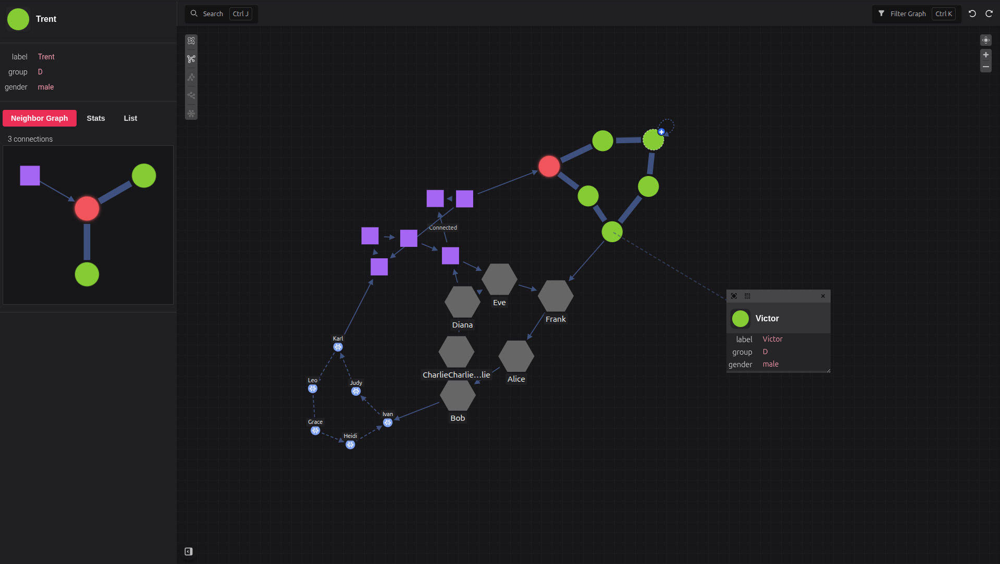

# Pivotick

Pivotick is a hackable TypeScript graph visualization library built on top of [D3 force simulations](https://d3js.org/d3-force/simulation). It renders directed or undirected graphs with interactive controls, force simulation, tree layout support, and optional UI elements such as sidebars, toolbars, context menus, and tooltips.



## Core Features

- Directed and undirected graph rendering
- Force-based simulation with optional worker support
- Tree/hierarchy layout support
- Different UI modes (`full`, `light`, `viewer`, `static`)
- Configurable node/edge styles, labels, and callbacks


## Getting Started

### Basic Usage

Pivotick can be used either as a modern JavaScript module or directly in the browser via a script tag.

```js
import { Pivotick } from 'pivotick'
import 'pivotick/dist/pivotick.css'

new Pivotick({
  container: document.getElementById('app'),
  data: {
    nodes: [
      { id: 1, data: { label: 'A' } },
      { id: 2, data: { label: 'B' } }
    ],
    edges: [
      { from: 1, to: 2 }
    ]
  }
})
```

## Installation

```bash
npm install pivotick
```

### 1. Use a GitHub Release (no build required)

If you don’t want to build the project yourself, download the latest release from GitHub.

Steps:

1. Go to the Releases page of the repository
1. Download the latest dist bundle
1. Extract it into your project

You should get files like:
```
pivotick.es.js
pivotick.umd.js
pivotick.iife.js
pivotick.css
```

Then use them depending on your environment:

**ES Module (recommended)**
```js
import { Pivotick } from 'pivotick'
import 'pivotick/dist/pivotick.css'

const app = new Pivotick({
    container: document.getElementById('app'),
    data: {
        nodes: [
            { id: 1, data: { label: 'A' } },
            { id: 2, data: { label: 'B' } }
        ],
        edges: [
            { from: 1, to: 2 }
        ]
    }
})
```

Browser (IIFE / UMD)
```html
<!DOCTYPE html>
<html>
  <head>
    <link rel="stylesheet" href="/assets/pivotick.css" />
    <script src="/assets/pivotick.iife.js"></script>
  </head>
  <body>
    <div id="app"></div>

    <script>
      const app = new Pivotick({
        container: document.getElementById('app'),
        data: {
          nodes: [
            { id: 1, data: { label: 'A' } },
            { id: 2, data: { label: 'B' } }
          ],
          edges: [
            { from: 1, to: 2 }
          ]
        }
      })
    </script>
  </body>
</html>
```

### 2. Build from source (recommended for development)
Use this if you want full control over the library or need to modify it.

```bash
git clone https://github.com/pivotick/pivotick.git
cd pivotick
npm install
npm run build
```

After building, the compiled files will be available in:
```
dist/
```

You can then import them directly depending on your environment:

**ES Module**
```js
import { Pivotick } from './dist/pivotick.es.js'
import './dist/pivotick.css'
```

**Browser build**
```html
<script src="./dist/pivotick.iife.js"></script>
```

## Styling

Pivotick comes with default styles included in `pivotick.css`:

You can customize the look in two ways:
- Use Pivotick's [built-in classes](/ui-styling#classes).
- Override styles using [CSS variables](/ui-styling#css-vars).

```css
:root {
  --pvt-node-color: #FDDA24;
  --pvt-node-stroke: #000000;
  --pvt-edge-stroke: #EF3340;
}

.pvt-node circle {
  fill: cyan;
}
```

## Docs & API Reference
- Full documentation: https://pivotick.github.io/Pivotick/
- Typed API reference: https://pivotick.github.io/Pivotick/api/html/classes/Pivotick.html


## Project Scripts
```bash
npm run dev               # Start Vite dev server
npm run build             # Build full project (types + all bundles)
npm run build:es          # Build ES module bundle
npm run build:browser     # Build browser (UMD + IIFE) bundle
npm run build:worker      # Build worker bundle
npm run preview           # Preview production build

npm run lint              # Run ESLint
npm run lint_fix          # Fix lint issues

npm run vitepress:dev     # Run documentation site locally
npm run vitepress:build   # Build documentation site
npm run vitepress:preview # Preview documentation build

npm run typedoc:dev       # Watch TypeDoc output
npm run typedoc:build     # Generate API docs

npm run docs:build        # Build full documentation (typedoc + vitepress)
```

## Contributing
1. Create a branch
1. Run `npm run build` and `npm run lint`
1. Open a pull request with a concise summary of behavior and API changes
1. Keep PRs focused and small